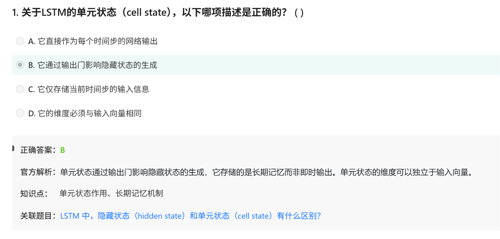

# 面试鸭 AI大模型 20260629

# 第一组 LSTM

# 第二组 ELMo(Embeddings from Language Models)

一种介于Word2Vec和BERT之间的过渡性技术（过渡的原因在于是动态向量）

使用乐多层双向LSTM

Q： 什么是动态词向量，什么是静态？

**动态词向量**的核心含义是：**同一个词，在不同的上下文（句子）中，拥有不同的向量表示。**

而**静态词向量**（如 Word2Vec、GloVe、FastText）是：**不管这个词出现在哪里，它的向量永远不变。**

# 第三组 GloVE

适合情感分析，不适合（相比较Word2Vec）那种需要邻近上下文ed如NER,Machine Translation, 

# 第四组 CBOW与Skip-Gram

这不是说 Skip-gram 让低频词“变好了”的绝对意义，而是**相对 CBOW 而言**：

- CBOW 对低频词“不友好”（训练机会太少，学不好）
- Skip-gram 对低频词“更友好”（每次出现都给多次训练机会，学得相对更好）

讲讲Word2Vec, CBOW，skip-gram,负采样的关系，举例说明

- Word2Vec就是一个工具包， Google 在 2013 年提出的，用于把word变成vec
- CBOW是用上下文猜中间词的训练方法，skip-gram是用中间词猜上下文的训练方法——skip-gram和n-gram毫无关系，前者是训练框架，后者只是取词方法
- 负采样是一种优化训练的方法。由于skip-gram任务本身就很难，所以用负采样可以简化。而CBOW任务本身就没有那么难，用层次 Softmax（Hierarchical Softmax）通常就已经足够好甚至比负采样效果更好

# 第五组 word2vec的超参数选择

**Word2Vec的超参数选择**

# 第六组 LSTM与GRU

# 第七组 负采样的问题

为什么引入负样本可以减少模型的计算量？

### **全量 softmax 的计算量爆炸**

在自然语言处理或推荐系统中，模型通常要解决一个**多分类问题**：

> 给定一个输入，从 N 个候选词（或物品）中选出最匹配的那一个。
• 如果词汇表大小 N = 10万（词嵌入场景）
> 
> 
> 每次训练更新，都需要计算这 N 个候选的分数，这叫做**“全量 softmax”**，计算量是O(N)
> 

负采样（Negative Sampling）的核心思想是：

> 我不需要把所有的 N 个候选都算一遍。我只需要算出 **1 个正样本** 和 **随机挑出来的 k 个负样本** 的分数就行。
> 

这样，原本需要计算 **N 个候选** 的复杂问题，被简化为只需要计算 **k+1 个候选**。

- 典型情况下，k 取 5 ~ 20。

### **一个更形象的比喻**

想象一场考试：

- **全量 softmax**：你必须把整本词典（10万个词）都背下来，考试时全部默写一遍，然后圈出正确答案。
- **负采样**：你只需要背 1 个正确答案和 10 个干扰项，考试只考这 11 个。

其他

