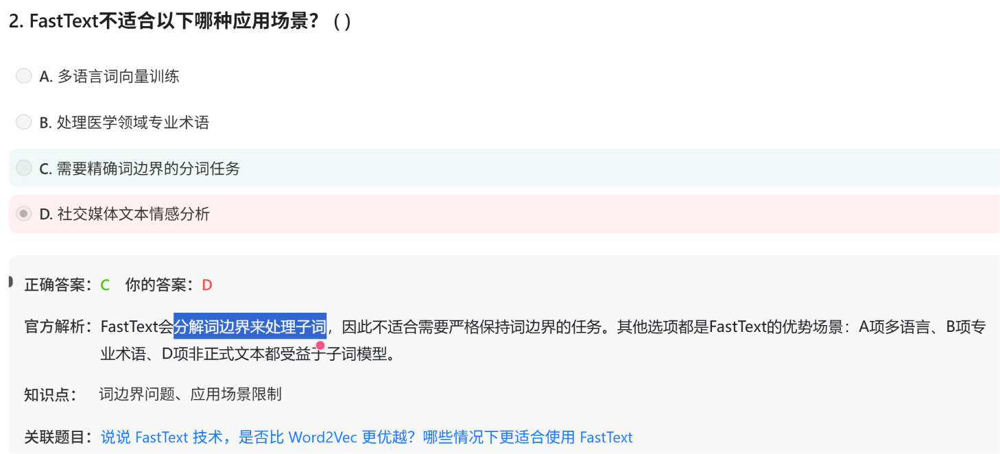

# 面试鸭 AI大模型 20260630

# 第一组 FastText

# 第二组 word2vec

# 第三组 hierachical softmax

# 第四组 LLaMA 与BERT

全称 Large Language Model **Meta AI**

BERT的MLM任务，全称叫**Masked Language Model**

BERT和CBOW的区别？——

（1）BERT一次Mask多个词（15%）而CBOW一次只Mask一个词

（2）至于所谓的单向双向——

| **模型** | **物理位置（左/右）** | **信息交互深度** | **通常被描述为** |
| --- | --- | --- | --- |
| **CBOW** | 左右都看 | 浅层（平均即止） | “浅层双向”或“伪双向” |
| **GPT** | 只看左边（自回归） | 深层（Transformer 12层） | **“单向”**（这个是真的单向） |
| **BERT** | 左右都看 | 深层（Transformer 12层） | **“双向”**（这个才是真正的双向） |

# 第五组 机器学习，高维数据降维

# 第六组 机器学习 SVM

# 第七组 四大文本相似度

余弦相似度，两向量，求俩的cos值，约相似约靠近1

Jaccard相似度：两集合，交集/并集

编辑距离——两个字符串，通过插入删除替换，从字符串1变成字符串2所需的最少操作数

词向量相似度

其他机器学习

**不加正则化**：目标是最小化损失函数

**加 L1 正则化**：目标变成了 **“在保证损失函数尽量小的前提下，让 |w1| + |w2| 也尽量小”**