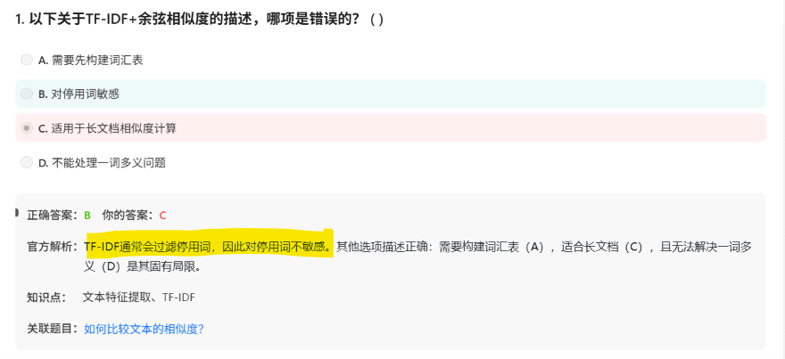

# 面试鸭 AI大模型 20260701

# 1. TF-IDF  与Word Embedding

Q1:

Q2:

### **第一层：TF-IDF 输出的是什么向量？（解答你的疑惑）**

你记得没错，TF-IDF 确实有数学公式：

TF-IDF=词频 (TF)×逆文档频率 (IDF)=词频 (TF)×逆文档频率 (IDF)

**它输出的向量长这样：**

假设你的词汇表里有 5 万个词（即维度是 5 万），那么某一个文档（比如一篇文章）的 TF-IDF 向量是：

`[0.12, 0, 0, 0.89, 0, 0, 0, 0.45, 0, 0, ...]` （总共 5 万个数字）

**特点**：

- 绝大多数位置是 **0**（因为一篇文章不可能包含词汇表里的所有词）。
- 只有文档里**真正出现过的词**，对应位置才有非零数值。
- 这种向量叫 **“稀疏向量（Sparse Vector）”**。

### **第二层：为什么 TF-IDF 不属于 Word Embedding？（核心考点）**

**Word Embedding（词嵌入）** 在学术界和工业界有一个**硬性定义**：

> **必须满足：稠密向量（Dense Vector）+ 低维度（Low-dimensional）+ 能捕捉语义关系。**
> 

我们拿 TF-IDF 和真正的 Word2Vec 对比：

| **对比维度** | **TF-IDF（你的疑惑点）** | **Word2Vec / GloVe（真正的 Embedding）** |
| --- | --- | --- |
| **向量维度** | **极高**（等于词汇表大小，比如 5 万维） | **很低**（通常 50~300 维，由人为设定） |
| **向量稠密度** | **稀疏（Sparse）**——大部分是 0 | **稠密（Dense）**——每个位置几乎都有非零小数 |
| **表示的对象** | 表示 **“一篇文档”**（整篇文章） | 表示 **“一个单词”**（单个词） |
| **是否包含语义** | **不包含**（只是统计词在文中出现了几次） | **包含**（“国王 - 男人 + 女人 ≈ 女王”这种语义运算） |

### 总结：

- **TF-IDF** 虽然输出向量，但它是一种 **“统计计数方法”**，属于 **“稀疏表示（Sparse Representation）”** 或 **“传统特征工程”**。
- 而 Word2Vec、GloVe、FastText 都是 **“神经网络/矩阵分解”** 生成的 **“稠密表示（Dense Representation）”**，这才是学术界公认的 **Word Embedding**。

# 其他

# 笔记

- 什么是早停策略？

| **早停（Early Stopping）** | 每训练一轮，都拿**没见过的验证集**测一下。一旦发现验证集准确率不再上升（开始下降），立刻停止训练。 | 好比炒菜时不停试吃，尝到味道最巅峰的那一刻**立刻关火**，再炒就糊了（过拟合）。 |
| --- | --- | --- |
- 什么是SMOTE？什么是插值？

### **（SMOTE）：到底什么是插值（Interpolation）？（重点举例）**

**Synthetic Minority Over-sampling Technique**

| **英文单词** | **中文含义** | **在算法中的对应动作** |
| --- | --- | --- |
| **Synthetic** | 合成的、人造的 | 不是复制原始数据，而是**人工制造**全新的样本（插值）。 |
| **Minority** | 少数的 | 专门针对**样本量较少的那一类**（比如诈骗短信、罕见病病例）。 |
| **Over-sampling** | 过采样 | 增加这一类的样本数量，让它从少数变成多数或平衡状态。 |
| **Technique** | 技术/方法 | 这是一种特定的数据处理算法。 |

**官方解析说**：SMOTE 是通过**插值（Interpolation）**生成新样本，**不是简单复制**。

**举例说明（用二维平面坐标来想）**：

假设你的少数类（诈骗短信）在特征空间里只有 **2 个样本**（为了直观，把它映射到二维平面上的两个点）：

- 样本 A（诈骗1）：坐标是 `(2, 3)` （代表某种用词特征）
- 样本 B（诈骗2）：坐标是 `(5, 4)` （代表另一种用词特征）

**如果是“简单复制”（错）**：

> 模型只会把 A 复制成 A1、A2、A3... 所有复制品都和 A **一模一样**。模型看来看去就这两张脸，毫无新意，很容易过拟合（死记硬背）。
> 

**如果是 SMOTE 插值（对）**：

> SMOTE 会在 A 和 B 的**连线上**，随机找一个**新点**。
> 
> 
> 比如新样本 C 的坐标 = A + 随机比例 × (B - A)
> 
> 假设随机比例取 0.5，那新样本 C 的坐标就是 `(3.5, 3.5)`。
> 
> **C 既像 A 又像 B，但它是一个全新的、从未出现过的样本！**
>