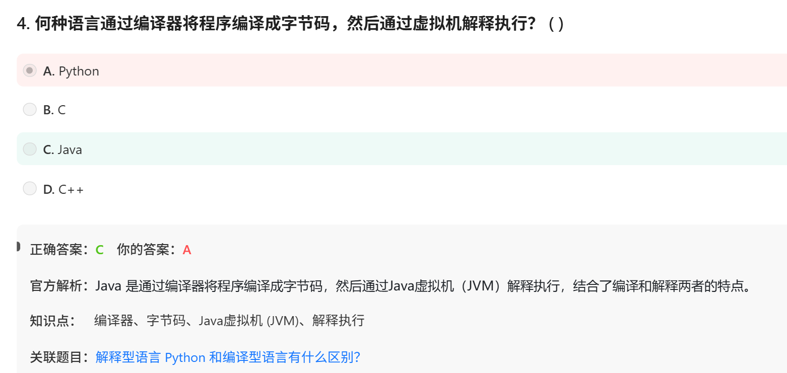

# 面试鸭-Python笔试题20260608 共22QAs

# 第一组： 解释型语言和编译型语言




[一口气解决编译型语言和解释型语言](https://app.notion.com/p/377d8f4669908094b0f4ca231ef7439b?pvs=21)

# 第二组：**装饰器**


相关笔记：

装饰器也可以用于类

装饰器可以接受参数

装饰器是可以嵌套使用的，一个函数可以同时被多个装饰器装饰。

装饰器本质：接受一个函数作为input，输出一个函数作为output

Q1:**wrapper（）函数 这个名字必须叫 wrapper 吗？——不是，约定俗成而已，换成inner()没有影响**

Q2：包装、装饰器对应的英文：decorator装饰器、wrapper包装

Q3：**`functools.wraps`  是干啥用的，不用和用了的区别是什么？**

[**`functools.wraps`**](https://app.notion.com/p/functools-wraps-379d8f466990800eaeaee97aac280121?pvs=21)

# 第三组 list vs tuple

笔记：

列表和元组都可以存储不同类型的数据并支持切片操作

元组只支持访问和查询方法，比如 index() 方法

# 第四组： python的内存管理机制


笔记：内存管理是**引用计数+分代垃圾回收**

Q4:**内存泄漏是不是就是内存满了的意思？**

| **概念** | **含义** |
| --- | --- |
| 内存满 | 可用内存接近 0，系统可能卡死或 OOM（Out Of Memory） |
| 内存泄漏 | 程序里有些内存**已经没用**了，但 **GC 没法回收**，随着时间越积越多 → 最终导致内存满——他不是强调满这个结果，而是强调“积攒堵塞
这个原因 |

Q5： GC是什么？

**GC = Garbage Collection（垃圾回收）**

Q6：什么叫”活过一次 GC“？

**GC 是什么？是动作，不是量词**

活过一次GC：在一次 GC 扫描中，这个对象**没有被判定为垃圾**，所以继续留在内存中

Q7：Python的自动内存管理机制，难道C没有？

### 没有

| **语言** | **内存管理方式** | **说明** |
| --- | --- | --- |
| **C** | 手动 | `malloc` / `free`，极易泄漏或崩溃 |
| **C++** | 手动 + RAII（智能指针） | 可手动，也可用 `unique_ptr` 等半自动 |
| **Python** | 自动（引用计数 + GC） | 开发者不关心释放 |
| **Java** | 自动（GC） | JVM 的 GC |
| **Go** | 自动（并发 GC） | 现代 GC |
| **Rust** | 所有权 + 借用（编译时检查） | 无运行时 GC，但无手动 free |
| **JavaScript** | 自动（GC） | V8 等引擎的 GC |

### **为什么C没有自动GC？**

- **性能至上**：C 用于操作系统、嵌入式、数据库内核，GC 的停顿不可接受
- **控制权**：程序员需要**精确控制内存何时释放**（如共享内存、DMA 缓冲区）
- **历史原因**：C 诞生于 1972 年，GC 理论还不成熟

Q8: GC的第0代、第1代、第2代是怎么运作的？

```python
第0代对象数量净增长 > 700
    ↓
触发一次【第0代GC扫描】
    ↓
扫描第0代，回收垃圾
    ↓
存活对象 → 晋升到第1代
    ↓
第0代GC次数 +1
    ↓
如果第0代GC次数 >= 10
    ↓
触发一次【第1代GC扫描】（扫描第1代 + 第0代）
    ↓
第1代存活对象 → 晋升到第2代
    ↓
第1代GC次数 +1
    ↓
如果第1代GC次数 >= 10
    ↓
触发一次【第2代GC扫描】（扫描所有代）
```

Q9： allocated - freed > 700  ——**第0代净增**>700 和第0代**目前对象数量**>700不是一回事儿吧？到底哪个是触发条件，同理第1代第2代呢？
Q10： **为什么没有第3代？**

实验证明，能活过两次GC的对象，大概率会一直存活到程序结束（比如模块级别的常量、缓存、单例）。再增加第3代边际收益极低，反而增加复杂度。

Q11：既然触发GC条件是净增长的数量而不是对象数量本身，那么**各代对象数量上限是不是——没有上限？**

对！

| **代** | **触发GC的条件** | **对象数量有无硬上限** |
| --- | --- | --- |
| 0 | 净增 > 阈值（默认700） | 无上限（只控制触发频率） |
| 1 | 第0代GC次数 > 阈值（默认10） | 无上限 |
| 2 | 第1代GC次数 > 阈值（默认10） | 无上限 |

Q12: **GC 扫描怎么判断哪些是循环引用，要清退？——不是用引用计数，而是用“标记清除”**

**标记清除（Mark-Sweep）简化流程**

1. **复制**所有对象的引用计数（不改变真实计数）
2. **从根对象**（全局变量、调用栈等）出发，沿着引用把能到达的对象标记为“存活”
3. 扫描结束后，**没被标记的对象**就是垃圾（包括循环引用孤岛）
4. 清退这些垃圾

Q13：**循环引用的对象为什么不是根对象？怎么被清退？**

根对象是**直接从 Python 解释器能到达**的对象，包括：

- 当前调用栈里的局部变量（比如接下来例子的循环引用对象被删除前）
- 全局变量（`__main__` 里的）
- 正在运行的函数、方法的内部变量
- 已经注册的 GC 根（如 `gc` 模块的一些内部对象）

```python
a = Node()
b = Node()
a.next = b
b.next = a
del a   # a 不是根了
del b   # b 不是根了
```

其他：

# 第一组 python 中 * 和 ** 详解

Q1: **args和***kwargs的区别？

| `*args` | 收集**多余的位置参数**为元组 | 解包**列表/元组**为位置参数 |
| --- | --- | --- |
| `**kwargs` | 收集**多余的关键字参数**为字典 | 解包**字典**为关键字参数 |

本质上，

- 在**定义**函数时（形参）， *和 `**` 是**打包**
- 在**调用**函数时（实参）， *和 `**` 是**解包**

| `*` | 函数定义：`def f(*args)` | **打包**（剩余位置参数 → 元组） |
| --- | --- | --- |
| `*` | 函数调用：`f(*[1,2,3])` | **解包**（列表/元组 → 位置参数） |
| `**` | 函数定义：`def f(**kwargs)` | **打包**（剩余关键字参数 → 字典） |
| `**` | 函数调用：`f(**{'a':1})` | **解包**（字典 → 关键字参数） |

Q2：**`*args` 必须叫 `args` 吗？**

**不必须**。`*` 是语法关键，后面的名字可以任意取。变量名 `args` 只是习惯（arguments 的缩写） `*agrrr`（完全可以）

Q3： args和kwargs的意思

**`kwargs`  keyword arguments** 

Q4： python中函数参数可以位置参数和关键词参数顺序打乱么？

```jsx
def test(*args, **kwargs):
    print(type(args), args)   # <class 'tuple'> (1, 2, 3)
    print(type(kwargs), kwargs) # <class 'dict'> {'x': 10}

test(1, 2, 3, x=10)

结果我用  test(1, 2, x=10, 3, a=2)  会报错么？
```

会报错！
`SyntaxError: positional argument follows keyword argument`

Q5： **`*` 强制关键字参数是啥机制？**

Python 3 允许在函数**定义**时使用单独的 `*` 来强制要求后面的参数必须用keyword argument传递：

```
def test(a, b, *, c):
    print(a, b, c)

test(1, 2, c=3)   # 正确
test(1, 2, 3)     # 错误，c 必须用关键字
```

# 第二组 单独的

Q6： python中的find()和index()函数是做什么的

——是查找某值出现在其中的序号位置（所以和lista[1]这种知道序号位置查元素内容，是相反的）

| **方法** | **所属类型** | **找不到时** |
| --- | --- | --- |
| `str.find()` | 字符串 | 返回 `-1` |
| `str.index()` | 字符串 | 抛出 `ValueError` |
| `list.index()` | 列表 | 抛出 `ValueError` |
| `tuple.index()` | 元组 | 抛出 `ValueError` |

```python
	index(value, start, end)
	
	t = (10, 20, 30, 20, 40, 20)

# 基本查找
print(t.index(20))        # 1

# 从索引2开始找
print(t.index(20, 2))     # 3  （**跳过索引1**的20，找到索引3的20）

# 在索引2到5之间找
print(t.index(20, 2, 5))  # 3  （**只搜索位置2,3,4**，找到索引3）-----和slicing一样左选右不选

# 查找不存在的元素
print(t.index(99))        # ValueError: tuple.index(x): x not in tuple----会报错！！
```

**安全使用 `index()` 的方法**

先用 `in` 判断存在性：

```
t = (10, 20, 30)

if 20 in t:
    idx = t.index(20)   # 安全
    print(idx)
else:
    print("不存在")
```

或用 `try-except`：

```
try:
    idx = t.index(99)
except ValueError:
    idx = -1   # 或者做其他处理
```

Q7： python中int为什么占用不是32bit4字节？——容器开销

**Python 的 `int` 是对象，不是 4 字节    。**  在 C 语言中，`int` 就是 32 位 = 4 字节。

但在 Python 中，整数是**对象**，包含：

- 引用计数（8 字节）
- 类型指针（8 字节）
- 实际数值（至少 4~28 字节不等，小整数还有缓存优化）

64 位 Python 中，一个普通的 `int` 对象（如 `1`, `2`, `3`）实际占用 **28 字节**（经验值，不同版本微调）。

```
import sys
print(sys.getsizeof(1))  # 28
print(sys.getsizeof(1000000))  # 也是 28（小整数范围更多）
```

Q8： python中list的内存结构？

```
列表对象（约 56 字节）
  ├── 引用计数（8）
  ├── 类型指针（8）
  ├── 底层数组指针（8）
  ├── 数组容量（8）
  └── 实际元素个数（8）

底层数组（容量 4 个槽） → 4 × 8 = 32 字节
   槽0 → 指向 int 1 的指针
   槽1 → 指向 int 2 的指针
   槽2 → 指向 int 3 的指针
   槽3 → 未使用（预留空间）
```

`sys.getsizeof(lst)` 只算：

- 列表对象本身的头部（约 56 字节）
- 底层数组的 **32 字节**
- **不包括**那 84 字节的 int 对象

总和 ≈ 56 + 32 = **88 字节**（实际显示 80 是版本优化，但量级一致）。

Q9：Python的.py文件如何变成能够运行在CPU上的机器码？

```python
你的 .py 文件 (文本)
      │
      ▼ (编译compile阶段，由 CPython 自动完成)
.pyc 字节码文件
      │
      ▼ (解释interpret执行，CPython 的主循环)
CPython 虚拟机（用 C 写的，早已编译成机器码）
      │
      ▼
CPU 执行机器码
```

注意：尽管CPython也做compile这个工作，但并不是compiler，而是生成字节码，然后去根据每一条字节码去执行对应的CPython机器码指令——这些是已经编译成机器码的