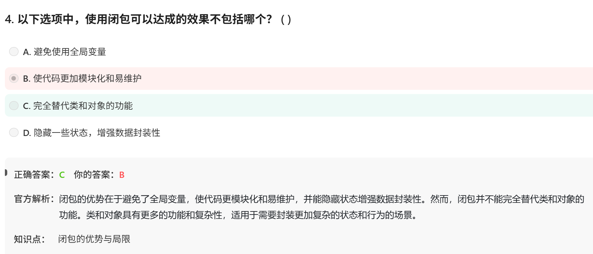

# 面试鸭-Python 20260611

# 第一组： 内存优化

# **Q1 工具以下哪种工具与内存优化检测无关：**

- `objgraph`：可视化对象引用关系，帮助发现**内存泄漏。**
- `memory_profiler`：逐行代码地去监控内存使用。
- `tracemalloc`：跟踪内存分配，定位内存增长来源。
- `timeit`：仅用于测量代码执行时间，与内存使用无关。

# Q2 为什么**使用生成器代替列表优化内存？**

**场景：** 生成 1 到 1000 万的平方和，不保留所有值。

**列表方式（高内存）：**

```python
def squares_list(n):
    return [i*i for i in range(n)]  # 同时存储 1000 万个整数

total = sum(squares_list(10_000_000))
```

**生成器方式（低内存）：**

```
def squares_gen(n):
    for i in range(n):
        yield i*i   # 每次只产生一个值

total = sum(squares_gen(10_000_000))
```

**区别：**

- 列表：一次性创建 1000 万个元素 → 内存占用 ~400MB（每个 int 28 字节）。
- 生成器：任何时候内存中只有一个值 → 内存占用 ~几十字节。

# 第二组 闭包

# Q3




闭包的实例：

```python
def outer(x):
    def inner(y):
        return x + y   # inner 引用了 outer 的变量 x
    return inner

closure_func = outer(10)   # outer 执行完毕，按理 x 应销毁
print(closure_func(5))     # 输出 15 —— 闭包保留了 x=10
```

# Q4**函数工厂（Function Factory） 是什么？和“普通外函数包内函数”（闭包）的区别？**

 

```python
def outer(x):
    def inner(y):
        return x + y
    return inner

f = outer(10)
```

| **角度** | **叫法** | **理由** |
| --- | --- | --- |
| 结构上看 | 就是一个返回函数的函数 | 语法上没有区别 |
| 关注“生产不同函数” | 函数工厂 | `outer(10)`、`outer(20)` 产出了不同行为的函数 |
| 关注“记住外部变量 x” | 闭包 | `inner` 记住了 `x=10` |

**同一个东西，两个名字而已。**

| 闭包 | 内部函数能记住外部变量，即使外部函数已结束 | 计数器、装饰器、回调函数 |
| --- | --- | --- |
| 函数工厂 | 根据参数批量定制/生成不同功能的函数 | `power_factory(2)` 生成平方函数，`power_factory(3)` 生成立方函数 |

# 第三组：  Python代码的执行过程


# Q5： Jython,PyPy,CPython,IronPython的区别

**IronPython**：Python 语法 + .NET 生态

| **特性** | **CPython** | **Jython** | **PyPy** |
| --- | --- | --- | --- |
| **目标平台** | 原生机器码（C语言编写） | Java 虚拟机 (JVM) | 独立（用Python写的Python解释器） |
| **字节码格式** | `.pyc` 文件（自定义格式） | Java 字节码 (`.class`) | 自己的字节码格式 |
| **运行方式** | 栈式虚拟机逐条解释执行 | JVM 负责执行，可混合 Java 类 | 有 JIT 编译，热点代码转为机器码 |
| **与宿主环境交互** | 通过 `ctypes`/C API 调用 C 库 | 直接调用 Java 类库 | 通过 `cpyext` 模拟 CPython C API |
| **速度特点** | 启动快，长期运行中等 | 与 Java 互调方便，Python 逻辑偏慢 | 长期运行通常比 CPython 快 |
| **典型用途** | 日常开发、生产环境 | 调用 Java 生态（如 Hadoop） | 替代 CPython 追求高性能 |

```python
CPython 流程：
.py → 编译 → CPython 字节码 → CPython 虚拟机解释执行 → 结果

Jython 流程：
.py → 编译 → Java 字节码 → **JVM 执行（含 JIT）** → 结果

PyPy 流程：
.py → 编译 → PyPy 字节码 → PyPy 虚拟机解释执行 → 
                          ↓（热点代码）
                        JIT 编译为机器码 → 结果
```

# 第四组 魔术方法


# **Q6魔术方法 是啥？**

(1)``__new__``  这种前后双下划线的funct

# Q6：英文？

(2)英文是 Magic Methods. 也叫 **"dunder methods"**（double underscore 的缩写）

# Q7：和特殊属性区别

(3)和__name__这种的区别

| **对比项** | **魔术方法（Magic Methods）** | **`__name__` 这种特殊属性** |
| --- | --- | --- |
| **命名格式** | `__方法名__`（两头双下划线） | `__属性名__`（也是两头双下划线） |
| **核心目的** | 定义类的**行为**（拦截操作符、函数调用等） | 提供对象的**元信息**（数据属性） |
| **典型例子** | `__init__`, `__add__`, `__call__`, `__getitem__` | `__name__`, `__doc__`, `__file__`, `__dict__` |
| **谁调用** | Python 解释器**自动调用**（如 `a + b` → `a.__add__(b)`） | 可以直接**读/写**（`obj.__name__`） |
| **是否可以自定义** | ✅ 可以在类中定义或重写 | ❌ 大多数是只读的系统定义属性 |

# Q8：被调用方法：

（4）为什么__add__就是用 + 来调用的？是python设定好的映射一一对应的调用方法？那么这些magic methods各自是怎么被调用的？

对，对，见下：

| **操作符** | **魔术方法** | **说明** |
| --- | --- | --- |
| `+` | `__add__(self, other)` | 加法 |
| `-` | `__sub__(self, other)` | 减法 |
| `*` | `__mul__(self, other)` | 乘法 |
| `/` | `__truediv__(self, other)` | 真除法 |
| `//` | `__floordiv__(self, other)` | 整除 |
| `%` | `__mod__(self, other)` | 取模 |
| `**` | `__pow__(self, other)` | 幂运算 |
| `&` | `__and__(self, other)` | 按位与 |
| `|` | `__or__(self, other)` | 按位或 |
| `^` | `__xor__(self, other)` | 按位异或 |
| `<` | `__lt__(self, other)` | 小于 |
| `<=` | `__le__(self, other)` | 小于等于 |
| `==` | `__eq__(self, other)` | 等于 |
| `!=` | `__ne__(self, other)` | 不等于 |
| `>` | `__gt__(self, other)` | 大于 |
| `>=` | `__ge__(self, other)` | 大于等于 |
| `[i]` | `__getitem__(self, i)` | 索引读取 |
| `[i]=v` | `__setitem__(self, i, v)` | 索引赋值 |
| `len(obj)` | `__len__(self)` | 长度 |
| `str(obj)` | `__str__(self)` | 字符串转换 |
| `repr(obj)` | `__repr__(self)` | 开发调试表示 |
| `in`  | `__contains__`  |  |
| `obj = MyClass()` | 先调用 `__new__`  再调用 `__init__` | 前面那个分配内存，后面的初始化属性值 |
| `del`  | `__del__`  | 销毁对象 |
| `obj = MyClass()`
`obj(参数)` | `__call__`  | 像调用函数一样调用obj |

所以一个生命周期，至少class中要有 `__new__,__init__,__del__` 

# Q9：repre英文。

（5）repr是啥：——representation

# Q10：给magic methods分分类？


 还有 `__enter__,__exit__` 以及 `__getattr__`  `__setattr__ __delattr__` 等

这些下次再看吧，没想到一个magic methods就这么多信息量了！！！！

# 第五组 Python 3比Python2的主要改变

# Q11： range()和xrange()在python2,python3的变化


| **Python 版本** | **`range()`** | **`xrange()`** |
| --- | --- | --- |
| Python 2 | 返回**列表**（占用内存） | 返回**生成器风格对象**（节省内存） |
| Python 3 | 返回**类似 `xrange` 的对象** | ❌ 已移除 |

# Q12：字符串处理


# Q13：异常处理的语法


小结：


# 第六组 Python的OOP

# Q14： OOP有哪四大特点？

封装、继承、抽象、多态

# Q15：继承有哪三类？

单继承、多继承、Mixin继承

# Q16：菱形继承、MRO机制、C3线性化算法是啥？

(1)菱形继承

```python
      A
     / \
    B   C
     \ /
      D
```

**（2）MRO（Method Resolution Order）**

| **版本** | **MRO 算法** | **特点** |
| --- | --- | --- |
| Python 2 经典类（旧式类） | 深度优先从左到右 | 有缺陷，可能出现无法预料的重写 |
| Python 2 新式类（继承 object） | C3 线性化 | 解决了经典类的问题 |
| Python 3（所有类都是新式类） | **C3 线性化** | 唯一算法 |

（3） C3 线性化算法

关键看merge的方法

```python
L[A] = [A]

L[B] = [B] + merge(L[A], [A])
     = [B] + merge([A], [A])
     = [B, A]  # A 可以提取

L[C] = [C, A]

L[D] = [D] + merge(L[B], L[C], [B, C])
     = [D] + merge([B, A], [C, A], [B, C])
     
# 第一步：检查 B（第一个列表头部）→ B 不在 [C, A] 的尾部？尾部的定义是除了第一个元素
# [B, A] 头部 B，尾部 [A]
# B 在 [B, C] 列表中出现，但因为 B 是头部，所以可以提取

# 详细步骤：
merge([B,A], [C,A], [B,C])
→ 取 B（第一个列表头部），不在 [C,A] 尾部（[A]），也不在 [B,C] 尾部（[C]）→ 提取 B
→ 剩余：merge([A], [C,A], [C])
→ 取 A（第一个列表头部），但 A 在 [C,A] 尾部（[A]）！检查下一个列表头部 C
→ 取 C（第二个列表头部），C 不在 [A] 尾部（[A] 无 C），也不在 [C] 尾部（[]）→ 提取 C
→ 剩余：merge([A], [A], [])
→ 取 A（第一个列表头部），不在 [A] 尾部（[]）→ 提取 A
→ 得到 [B, C, A]

L[D] = [D, B, C, A]
```

`C 的线性化 = [C] + merge(父类的线性化列表, 父类列表)`

**merge 规则：**

1. 取第一个列表的头部元素
2. 如果该元素不在任何其他列表的尾部，则提取它
3. 否则跳过，继续下一个列表的头部
4. 重复直到所有列表为空

# Q17： 多态的实现方法？

（1）鸭子类型 

（2）子类重写父类方法


# Q18：抽象的实现方法

from abc import ABC,abstractmethod


# 第七组 多线程多进程

