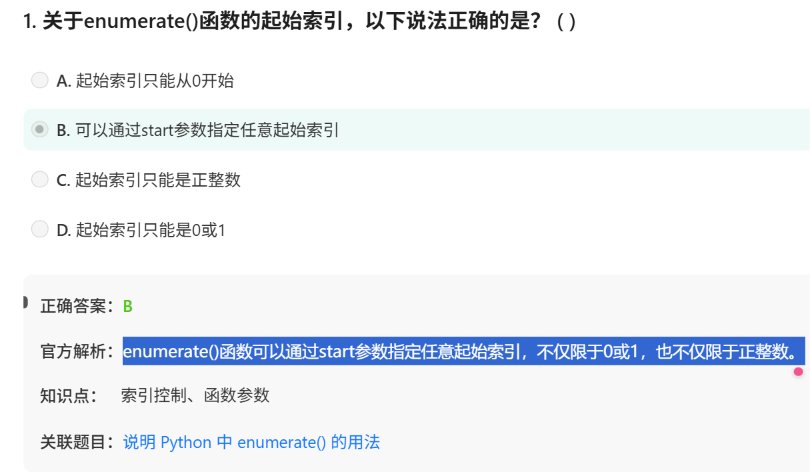

# 面试鸭20260615

80

# 第一组 enumerate()函数



指定起始索引——**并不是跳过一些行不去遍历，而是从0-based变成1-based!!!!**

```python
for index, value in enumerate(items, start=1):
    print(index, value)

```

可以用在字典上

```python
dict_items = {'a': 1, 'b': 2, 'c': 3}
for key, value in enumerate(dict_items):
    print(key, value)
    
   
会得到
a 1
b 2
c 3

```

读取文件时候顺便把行号读出来：

```python
with open('file.txt', 'r') as file:
    for line_number, line in enumerate(file, **start=1**):
        print(line_number, line)

```

与zip()函数一起用，遍历多个序列

```python
items1 = [1, 2, 3]
items2 = ['a', 'b', 'c']
for index, (item1, item2) in enumerate(zip(items1, items2)):
    print(index, item1, item2)

```

# 第二组 split()函数和join()函数


# 第三组 垃圾回收（内存）


gc.collect()就是手动开垃圾回收garbage collector


# 第四组 大小写转换

Q: lower()和casefold()的区别？


Q： capitalize()和title()的区别：

当字符串中有多个单词时，capitalize()只转换字符串的第一个字母，而title()转换每个单词的首字母


Q：Python区分大小写


# 第五组 any()与all()函数


空真有点难绷，这不很容易让人想到周杰伦真空么

# 第六组 Flask架构


# 第七组 合法标识符


字母、数字、下划线（这有出题点）。不能数字开头（这有出题点）、不能是保留关键词（这有出题点）


笔记： PEP 8 风格指南

（1）变量、函数、模块（.py文件 ）、包（含__init__.py的文件夹）——snake_case格式

（2）类——CamelCase或者叫PascalCase——（注意看，snake_case本身也是小写字母+下划线，CamelCase本身也是首字母大写+无中断，有趣呢）

（3）魔术方法或特殊变量名 **`__variable__` 双下划线**

(4) 常量应该用全大写字母加下划线——SNAKE_CASE

Q： 什么叫单字符变量名，什么叫描述性变量名？

**单字符变量名——只用一个字母（或一个字符）作为变量名——x,y,z**

**描述性变量名——用有意义的单词或短语作为变量名——**`user_age`

Q：为什么python可以用中文作为变量名？

Python 3 支持 Unicode 命名

——没错，Python2只支持ASCII（字母、数字、下划线），就不能中文作为变量名了

# 第八组 pass

实际上pass不仅仅是def function1: pass这种空操作占用的作用，还有其他用处！


解释如下——简单说就是{}或者end-end


Q: pass和 return None 有什么区别?在函数里用哪个更合适?

回答:**语义（意图）**完全不同。pass表示“这里故意留空,**什么都不做**";return None表示”函数执行到此结束,**返回值是None**"。
虽然一个只有pass的函数最终也会**隐式返回None,但意图不一样**。搭框架阶段用pass,表示待实现;如果函数逻辑已经完整、确实不需要返回有意义的值,那就显式写return None或者干脆return,让读代码的人知道这是设计好的。

Q: 如果我在生产代码里发现大量pass,你觉得说明什么问题?

大概率是**代码还处于半成品状态,框架搭好了但实现没跟上**。偶尔一两个pass用在异常吞除或抽象方法里完全正常,
但如果到处都是,要么是开发节奏太赶没来得及补,要么是设计过度,定义了一堆用不上的类和方法。**比较好的做法是把pass 替换成 raise NotImplementedError**，这样真跑到那段逻辑至少会炸出来,不会悄悄吞掉。

# 第九组 yeild


Q1 yeild是啥，和return有啥区别？

yeild的使用例子——搭配next

```python
def simple_generator():
    yield 1
    yield 2
    yield 3

gen = simple_generator()

print(next(gen))  # 输出: 1
print(next(gen))  # 输出: 2
print(next(gen))  # 输出: 3

```

Q2: 什么是生成器表达式，和列表推导式有啥区别？

——差不多，但是返回的是生成器而不是列表，用的是()而不是[]

```python
gen_exp = (x * x for x in range(5))
print(next(gen_exp))  # 输出: 0
print(next(gen_exp))  # 输出: 1

```

Q3-4-5是一组——yeild的双向通信

Q3：yeild的双向通信(send()方法)是啥？

```python
def double_yield():
    x = yield
    while True:
        x = yield x * 2

gen = double_yield()
next(gen)  # 启动生成器
print(gen.send(10))  # 输出: 20
print(gen.send(5))   # 输出: 10

```

Q4： 两次调用send()，分别暂停在哪，开始在哪？

第一次next(gen)，暂停在x = yield的右边，此时return 一个None,x还没有被赋值

第一次调用send()，开始在x = yield，**10 被 传入给”yield return”这个整体（不是传给yield这一个关键词而已**）于是，跑x= 10，再往下，运行到yield x*2，输出20，并停止，此时x还没有被赋值为20

第二次调用send()，开始在**yield x * 2这个整体，被传入了5这个数进行替代**——于是运行x = 5，再往下就运行yield x * 2输出10，并再次终止

————很重要，不要以为send是send给了x或者yield，而是yield表达式这个整体！！！

Q5： 为啥没有入参（形式参数）？只能send一个值么，多个怎么办？

是的，没有形式参数！

想传多个值怎么办？——用元组：send((5,10))

```python
def process():
    x, y = yield
    while True:
        x, y = yield x + y
```


Q6 其他的方法


# 第十组 三元表达式

Q1： 什么是python的三元表达式？


C选项是C / C++ / Java / JavaScript / C#、Ruby，Swift这些的用法（也是我印象中的传统用法）

`status = "成年" if age >= 18 else "未成年"`VS`int status = age >= 18 ? 1 : 0;`

Q2：性能问题


Q3 可以嵌套三元表达式么？长什么样？

——可以但不建议

```python
x = 10
result = "正数" if x > 0 else ("负数" if x < 0 else "零")   # 注意这里是括号
print(result)  # 输出: 正数

```

Q4： 三元表达式和三元组表达式一样么？

| **中文** | **英文** | **是什么** |
| --- | --- | --- |
| **三元表达式** | **Ternary expression** 或 **Conditional expression** | `a if condition else b`，一种控制流语法 |
| **三元组表达式** | **Triple expression** 或 **Tuple expression with 3 elements** | `(1, 2, 3)`，包含三个元素的元组 |

# 第11组 dir()与help()

Q1 dir英文全称是什么？——directory

Q2 这俩函数入参是啥？——object，比如类、函数、模块

Q3 这俩的返回内容的区别？

`help()`函数主要用于查看对象（如函数、模块、类等）的**详细文档说明**，包括**使用方法和示例**。

`dir()`函数主要用于**列出**对象的所有**属性和方法**，但不提供详细的文档说明。

Q4 这俩，假如我不传入object，默认会输出什么？

```python
# dir()
# 在全局作用域
x = 10
y = "hello"

print(dir())
# 输出: ['__annotations__', '__builtins__', '__doc__', '__loader__', '__name__', '__package__', '__spec__', 'x', 'y']
# 包含当前定义的名字 x, y 以及 Python 内置的一些特殊变量
```

```python
# help()
help()
# 输出:
# Welcome to Python 3.x's help utility!
# 
# If this is your first time using Python, you should definitely check out
# the tutorial on the Internet at https://docs.python.org/3.10/tutorial/.
# 
# Enter the name of any module, keyword, or topic to get help on writing
# Python programs and using Python modules.  To quit this help utility and
# return to the interpreter, just type "quit".
# 
# help> 
# 
# 👆 进入交互式帮助界面，光标在 help> 后等待输入
```

| **函数** | **无参数时的行为** | **返回类型** |
| --- | --- | --- |
| `dir()` | 返回**当前作用域**内的变量、函数、模块等名称列表 | `list` |
| `help()` | 启动**交互式帮助系统**，在控制台中进入帮助界面 | ❌ 不返回，进入交互模式 |


# 第12组 dictionary

Q1 字典的有序性？


字典在3.7以前是无序的，之后是插入顺序

Q2: 删除，remove,pop,与list的区别

**list 中的 `remove()` vs `pop()`**

| **方法** | **行为** | **删除方式** | **返回值** | **从哪删** |
| --- | --- | --- | --- | --- |
| `list.remove(value)` | 删除**第一个匹配的值** | 按值查找，从左到右 | `None` | 从左往右 |
| `list.pop(index)` | 删除**指定索引位置的元素** | 按索引 | 被删除的元素 | 可指定位置，默认从**末尾** |

**dict 中没有 `remove()`，只有 `pop()`**

| **方法** | **行为** | **返回值** | **说明** |
| --- | --- | --- | --- |
| `dict.pop(key)` | 删除指定 key 的键值对 | 被删除的 value | 必须传 key |
| `dict.clear()` | 清空字典 | `None` | 全部删除 |
| `del dict[key]` | 删除指定 key | 无 | 语句，不是方法 |

补充：

（1）dict中的key不会重复，所以pop()完以后就不会有这个key了，不像list，remove掉一个元素值以后，其实还有可能没有清理干净

（2）dict.pop()其实有点像list.remove()因为是按照所谓的“元素”，但是不同的，dict中这个pop()你也可以理解和list.pop()像，因为都是O（1）就找到了。

延申Q3：那么list中怎么一口气删光重复的某值？

——列表推导式

```
# 删除所有值为 1 的元素
lst = [1, 2, 1, 3, 1, 4, 1]
lst = [x for x in lst if x != 1]
```

Q4 字典的遍历


Q5

.keys()

.values()

.items()

- 返回的是视图对象如dict_keys([1,2,3])
- 原来dict变了这个view object也会变
- 用list()可转成列表。

# 第13组 is 和 ==

Q1： 二者原理上的区别？

is 是看内存地址     == 看值

is 用id()，==用对象的__eq__方法（默认是调id()但可以重写）

is “是不是同一个人”， == “长得是不是一样”

Q2：绝大多数都用==，什么时候用is?

(1)PEP 8 中规定用 is None

(2)is True或者is False

Q3： 小整数缓存和字符串驻留哪些？

-5到256这些数

只含有字母、数字、下划线的字符串

仅限CPython


Q4： `__eq__` 的机制

```python
class User:
    def __init__(self, uid):
        self.uid = uid

u1 = User(1001)
u2 = User(1001)
print(u1 == u2)  # False，没重写 __eq__，默认比 id

class BetterUser:
    def __init__(self, uid):
        self.uid = uid   #注意这里就是uid

    def __eq__(self, other):
        return isinstance(other, BetterUser) and self.uid == other.uid

u1 = BetterUser(1001)
u2 = BetterUser(1001)
print(u1 == u2)  # True，按 uid 比较

```

# 第14组  继承


**方法签名（Method Signature）** 指的是：方法名、参数列表（参数个数、参数顺序、参数类型）。**“保持相同的方法签名” 示例**

```
class Parent:
    def greet(self, name, age):
        return f"{name} is{age} years old"

class Child(Parent):
    def greet(self, name, age):   # ✅ 方法名、参数个数、参数顺序完全一样
        return f"Hello,{name} ({age})"
```

**违反方法签名（改变签名）**

```
class Child(Parent):
    def greet(self, name):        # ❌ 少了一个参数，改变了签名
        return f"Hello,{name}"
```


Q： 抽象基类是啥，为啥要搞抽象？大概长啥样？

（1）是什么？

抽象基类是一种**不能被实例化的类**，它专门用来定义**接口规范**，要求子类必须实现某些方法。

（2）为什么？

想象你是一个项目经理，要求所有员工都必须实现 `work()` 方法：

- 普通方式：写文档告诉程序员“记得实现 work 方法”，但别人可能忘记
- 抽象基类方式：强制子类必须实现，否则**创建对象时就报错**

（3）长啥样？

```python
from abc import ABC, abstractmethod

# 定义抽象基类
class Animal(ABC):
    @abstractmethod
    def make_sound(self):
        """子类必须实现这个方法"""
        pass
    
    @abstractmethod
    def move(self):
        """子类必须实现这个方法"""
        pass

# 正确使用：子类实现所有抽象方法
class Dog(Animal):
    def make_sound(self):
        return "汪汪"
    
    def move(self):
        return "跑"

class Bird(Animal):
    def make_sound(self):
        return "叽叽"
    
    def move(self):
        return "飞"

# 错误使用：子类没有实现所有抽象方法
class Fish(Animal):
    def move(self):
        return "游"
    # ❌ 没有实现 make_sound()，Fish 仍然无法实例化

# 测试
dog = Dog()
print(dog.make_sound())  # 汪汪

bird = Bird()
print(bird.move())       # 飞

# fish = Fish()  # ❌ TypeError: Can't instantiate abstract class Fish with abstract method make_sound

# animal = Animal()  # ❌ TypeError: Can't instantiate abstract class Animal
```

**抽象基类 vs 普通继承**

| **对比** | **普通父类** | **抽象基类** |
| --- | --- | --- |
| **能否实例化** | ✅ 能 | ❌ 不能 |
| **子类是否必须实现方法** | 不强制（可选重写） | 强制（不实现报错） |
| **主要目的** | 代码复用 | 定义接口规范 |
| **检查接口** | 需要手动 `hasattr` | `isinstance(obj, ABC)` |

Q： 这不很像鸭子类型？二者异同？

对比，鸭子类型

```python
def make_it_sound(animal):
    animal.sound()  # 只要对象有 sound() 方法就行

class Dog:
    def sound(self):
        print("汪汪")

class Duck:
    def sound(self):
        print("嘎嘎")

class Car:  # 车也有喇叭
    def sound(self):
        print("滴滴")

make_it_sound(Dog())   # 汪汪
make_it_sound(Duck())  # 嘎嘎
make_it_sound(Car())   # 滴滴 —— 车也能"叫"
```

抽象基类

```python
from abc import ABC, abstractmethod

class Soundable(ABC):
    @abstractmethod
    def sound(self):
        pass

class Dog(Soundable):
    def sound(self):
        print("汪汪")

class Duck(Soundable):
    def sound(self):
        print("嘎嘎")

class Car(Soundable):
    # 如果没有实现 sound()，Car() 会报错
    def sound(self):
        print("滴滴")

def make_it_sound(animal):
    animal.sound()

make_it_sound(Dog())   # 汪汪
make_it_sound(Duck())  # 嘎嘎
make_it_sound(Car())   # 滴滴
```

区别来了

```python
# 假设有一个类没有继承 Soundable，但有 sound() 方法
class Robot:
    def sound(self):
        print("哔哔")

# 鸭子类型：✅ 可以工作
make_it_sound(Robot())  # 哔哔

# 抽象基类类型检查：❌ 被拒绝（如果函数里做了 isinstance 检查）
def make_it_sound_strict(animal):
    if not isinstance(animal, Soundable):
        raise TypeError("必须是 Soundable 的子类")
    animal.sound()

make_it_sound_strict(Robot())  # TypeError！
```

Q： isinstance和issubclass的区别？

| **函数** | **作用** | **检查的是什么** |
| --- | --- | --- |
| `isinstance(obj, Class)` | 检查**对象**是否是某个类的实例 | 对象 → 类的关系 |
| `issubclass(Sub, Parent)` | 检查**类**是否是另一个类的子类 | 类 → 类的关系 |


# 第15组 关系比较


# 第16组 python内置数据类型


# 第17组 成员运算符

Q1： 什么是成员运算符

——主要就是in 和not in


Q2：时间复杂度？


# 第18组 多进制数


返回的是数还是字符串？


# 第19组 位运算符


# 第20组 逻辑运算符


Q 1 ： 什么叫“最后计算值“？

```jsx
# and：遇到假就停，返回第一个假值；否则返回最后一个值
print(0 and 100)   # 0（假，返回 0）
print(1 and 100)   # 100（真，继续算，返回最后的 100）
print(1 and "hi")  # "hi"
print([] and 99)   # []（空列表是假，返回 []）

# or：遇到真就停，返回第一个真值；否则返回最后一个值
print(1 or 100)    # 1（真，停，返回 1）
print(0 or 100)    # 100（0 是假，继续算，返回 100）
print(0 or [])     # []（两个都假，返回最后一个 [])
```

Q2：**`not` 接受任何真值测试对象（并且总是返回布尔值），是什么意思？**

```jsx
print(not 0)       # True（0 是假 → not 真）
print(not 1)       # False（1 是真 → not 假）
print(not [])      # True（空列表是假）
print(not [1,2])   # False（非空列表是真）
print(not "hello") # False（非空字符串是真）
print(not "")      # True（空字符串是假）
```

# 第 组 其他

Q： 什么叫链式比较？

1<a<3

Q： 什么叫逻辑短路计算？

1）`and`运算符的第一个操作数为False时；2）`or`运算符的第一个操作数为True时

Q： 元组解封装，除了* 还有其他的？

（1）函数返回值为tuple来解封装

（2）for循环返回tuple来解封装

（3）集成解封装（用*）

```jsx
a, *middle, c = (1, 2, 3, 4, 5)
print(f"a: {a}, middle: {middle}, c: {c}")

```

（4）交换变量！！！没错这个的原来居然是解封装tuple!

```jsx
x, y = 5, 10
x, y = y, x
print(f"x: {x}, y: {y}")

```


（解封装以后是list不再是tuple了！）