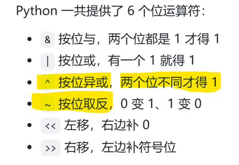

# 面试鸭 20260616

40 + 5 + 5 + 5 + 5

# 第一组 位运算符




~ 取反符号这里有大坑：

总结来说就是**~x = -x - 1**

原理是：其实是以高位补码形式储存的


Q： 什么叫“解封装嵌套元组”？

```jsx
t = (1, (2, 3), 4)

# 方式1：把里面的元组作为一个整体
a, b, c = t        # a=1, b=(2,3), c=4

# 方式2：继续把里面的元组也拆开
a, (b, c), d = t   # a=1, b=2, c=3, d=4
```

这个 `a, (b, c), d = t` 就是 **“解封装嵌套元组”**。

这道题非常好： 异或运算的可逆性


# 第二组 下划线标识符


# 第三组 声明与赋值多变量


注意，星号解包后得到的是list不是tuple


# 第4组 单双引号

在Python中,单引号('')和双引号(““)基本上是等价的。

- 单引号包双引号，或者双引号包单引号，不需要转义字符——"It's a car."或'He said "Hello!"'

单包单、双包双，就需要转义字符\了


- 三重引号，可以单引号，也可以双引号 ‘’’ 或者”””

# 第5组 +,f-string,join(),format()


# 第6组 range()


range()对象，只保存start,stop,step三个数，每次需要时再惰性计算


# 第7组 代码注释


# 第八组 分支语句的三种处理方法


这个第二个参数怎么理解，举例如下：

假设我们有一个字典，存了两种水果的价格：

```
price = {
    "苹果": 5,
    "香蕉": 3
}
```

**情况1：查存在的 key（只用第一个参数）**

```
print(price.get("苹果"))   # 输出：5
```

这里只给了**第一个参数** `"苹果"`，字典里有，所以返回 `5`。

---

**情况2：查不存在的 key，不给第二个参数**

```
print(price.get("西瓜"))   # 输出：None
```

这里只给了**第一个参数** `"西瓜"`，字典里没有，所以返回 `None`（空）。

---

**情况3：查不存在的 key，给第二个参数（这就是题目的核心！）**

```
print(price.get("西瓜", 0))   # 输出：0
```


但是，尽管所谓的字典映射是O(1)

但是


Q： 什么叫“结构化匹配”？

**——“拆包”**，这叫**结构化匹配**

比如：

```jsx
# 你选的 B（错误）：match 不仅能匹配字符串，还能匹配复杂结构
# 正确答案 C（正确）：看下面，match 直接把元组 (x, y) 里的值拆出来了
point = (5, 0)

match point:
    case (0, 0):      # 匹配原点
        print("原点")
    case (x, 0):      # 匹配 y=0，并把 x 的值提取出来（结构化拆解！）
        print(f"X轴上的点，x={x}")  
    case _:
        print("其他点")
```

# 第9组 map()函数


# 第10组 iterator


Q：generator和iterator的区别是啥，在python中？

- **Iterator（迭代器）**：是一个**已经存在的、可以逐个取值的对象**。它就像一本**已经写好的书或者光盘**，你可以一页一页翻。——但不同的是不能往回翻
- **Generator（生成器）**：是一个**专门用来制造迭代器的工具**。它就像一台**印刷机或者直播机**，你需要的时候才印一页出来，不占存储空间。

**关系**：生成器一定是迭代器，但迭代器不一定是生成器。

举例说明

```jsx
# 创建一个列表（这是可迭代对象，不是迭代器）
my_list = [1, 2, 3, 4, 5]

# 用 iter() 把它变成迭代器
my_iterator = iter(my_list)

# 用 next() 逐个取值
print(next(my_iterator))  # 输出: 1
print(next(my_iterator))  # 输出: 2
print(next(my_iterator))  # 输出: 3
print(next(my_iterator))  # 输出: 4
print(next(my_iterator))  # 输出: 5
print(next(my_iterator))  # 再次调用会报错 StopIteration（因为取完了）
```

# 第2组 其他


Q ： 为什么range和list 的slice是左闭右开的？

好处是，range(a,b)这样的话，长度就是b-a了——好像很有道理欸

数据类型转换


`__name__` 函数


字符串反转的三种方法


reversed() + join()的例子

```jsx
s = "hello"
result = ''.join(reversed(s))
```