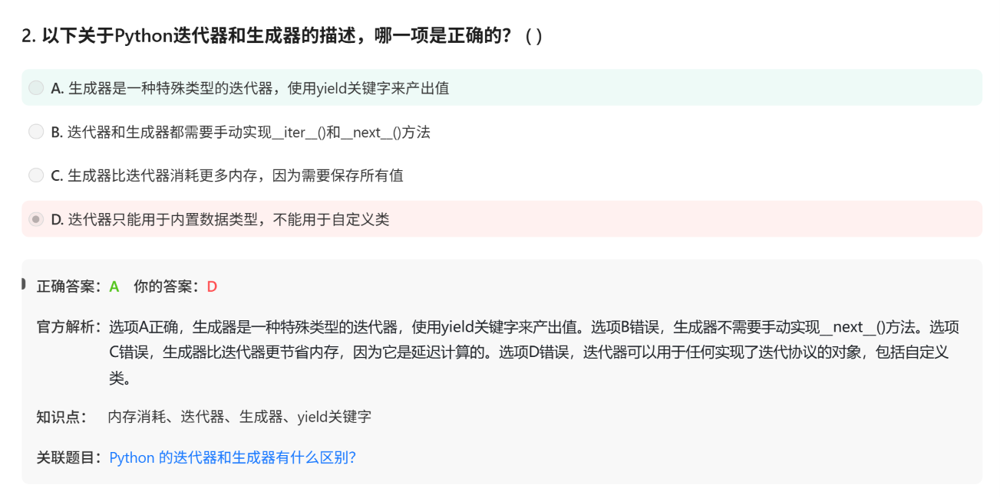

# 面试鸭 python 20260626

# 第一组 generator与iterator(以及与iterable)

generator是一种懒人版iterator

iterator要实现俩方法： `__iter__()` 以及 `__next__()`

iterable对象只需要实现一种方法 `__iter__()` ，比如list就是一种iterable，Iter(lista)返回的就是一个iterator

而iter()方法返回的是自身

为啥要搞iterable?——让一个list可以创造出多种iterator而互相不受对方状态干扰

generator生成器就是用一个yield省略掉iterator的俩方法，语法简单了一些。而且更省内存——因为延迟计算

生成器表达式 seq = (x**2 for x in range(100))

python中内置的iterator:   zip(), enumerate(),map(),filter(),itertools.chain()以及itertools.islice()等

文件对象是iterator




Q2 ： filter()函数

filter(func,listA)，返回的是func后为True的


Q3： reduce()函数

map(),reduce(),filter()数据流处理三剑客

- 但是其实内置的sum,max,min,math.prod都是C写的，会比map()更快，

reduce(func,iterable, `init_value` )  注意看，这里你可以设置初始值，防止报错

- map()和filter()都是内置函数，但reduce()要from functools import reduce


# 第二组 pickling 与 unpickling

中文：序列化与反序列化对象

序列化意思：把python对象变成字节流，从而存储或者传输

所以model文件常常是.pkl文件

有安全性问题


# 第三组 函数重载

- 重复而不是重量（不是超载）
- 什么是函数重载function overloading?

```jsx
// 同一个函数名 "add"，被"重复"定义了三次
// 这就是 "重载" —— 重复地载入（定义）同一个名字

class Calculator {
    int add(int a, int b) {          // 版本1：两个整数
        return a + b;
    }
    
    double add(double a, double b) { // 版本2：两个浮点数
        return a + b;
    }
    
    int add(int a, int b, int c) {   // 版本3：三个整数
        return a + b + c;
    }
}
```

- 为什么python不搞函数重载？

（1）动态数据类型

（2）默认参数、*args 和 **kwargs 等特性可以灵活处理不同数量和类型的参数


# 第四组 lambda函数


- 什么叫回调函数：   一般函数是我主动调用，回调函数是注册在浏览器中，等待事件来触发

```jsx
# 给按钮绑定回调（假设用 tkinter GUI）
import tkinter as tk

root = tk.Tk()
button = tk.Button(root, text="点击我", command=lambda: print("按钮被点了！"))
button.pack()
root.mainloop()

# 注意：这里用 lambda 是因为需要打包一个简单的行为，
# 如果业务逻辑复杂（比如表单验证、网络请求），就应该用 def 定义正式函数。
```

# 第五组 match()与search()


- match 从头开始，search全文搜索


match 没找到时，返回的是None

- 相同点：都要import re 然后re.match(pattern,text)或者re.search(pattern,text)
- fullmatch比match要求更严格，主要用于手机号验证等等更严格的场景

```jsx
re.match(r'\d+', '123abc')      # 匹配 '123'，尾巴的 abc 不管
re.fullmatch(r'\d+', '123abc')  # None，整体不是纯数字
re.fullmatch(r'\d+', '123')     # 匹配 '123'

```

- 如果想找出所有匹配而不只是第一个,用findall或 finditer:

```jsx
text = "价格: 100元, 运费: 20元, 总计: 120元"

re.findall(r'\d+', text)   # ['100', '20', '120']

for m in re.finditer(r'\d+', text):
    print(f"位置 {m.start()}-{m.end()}: {m.group()}")
# 位置 4-7: 100
# 位置 14-16: 20
# 位置 23-26: 120

```