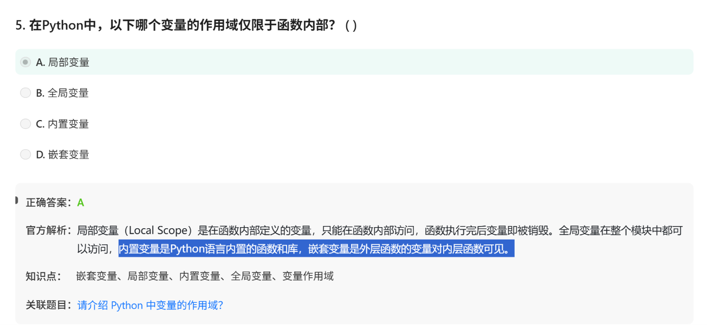

# 面试鸭python 20260627

# 第一组  四种变量的作用域

LEGB顺序:

- Local Scope,Enclosing Scope（嵌套作用域，外层函数的变量对内层函数可见）,Global Scope,Built-in Scope

改Enclosing时候用nonlocal，改global变量时用global

# 第二组： 字符串替换

唯一的选择：str.replace()

# 第三组*args 和 **kwargs

# 第四组： KeyError, TypeError, ValueError

