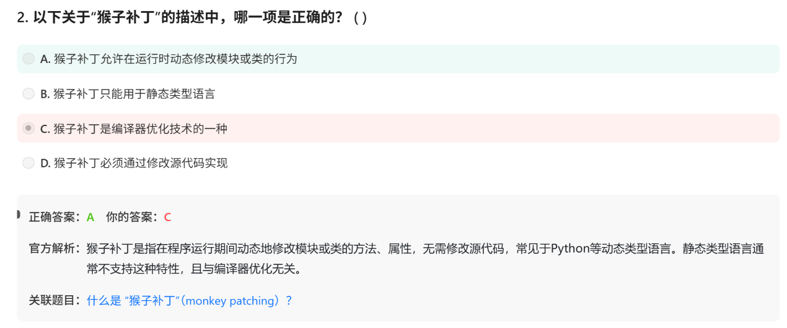

# 面试鸭 python 20260628（一周目完结）

# 第一组 猴子补丁 monkey patching

临时改变某class的function

```jsx
class Dog:
    def speak(self):
        return "Woof!"

def new_speak():
    return "Meow!"

# 创建Dog类对象
dog = Dog()

# 原来的speak方法
print(dog.speak())  # 输出：Woof!

# ---------- 猴子补丁，使用new_speak替换speak方法-------------
Dog.speak = new_speak

# 替换后的speak方法
print(dog.speak())  # 输出：Meow!

```




# 第二组 模块module与包package


# 第三组 PEP 8 风格规范


补充命名规范：

常量：全大写_下划线
变量、函数：snake_case
class: CamelCase
module: snake_case
package: snake——但不要underscore


# 第四组： 类与变量

## Q1： 类变量与实例变量

```jsx
class Student:
    total_students = 0  # 类变量
    
    def __init__(self, name, age):
        self.name = name  # 实例变量
        self.age = age    # 实例变量
        Student.total_students += 1  # 修改类变量

student1 = Student("Alice", 20)
student2 = Student("Bob", 22)

print(Student.total_students)  # 输出: 2
print(student1.name, student1.age)  # 输出: Alice 20
print(student2.name, student2.age)  # 输出: Bob 22

```


## Q2：**`_` 和 `__` 的区别（重点！）**

| **特征** | **`_variable` (单下划线)** | **`__variable` (双下划线)** |
| --- | --- | --- |
| **名称** | 受保护（Protected） | 私有（Private） |
| **命名约定** | 约定俗成 | 名称修饰（Name Mangling） |
| **访问限制** | 仅约定，Python不强制 | Python会改名，但依然可访问 |
| **子类继承** | 子类可以访问 | 子类**不能**直接访问（被改名） |
| **IDE提示** | 会提示"受保护" | 会提示"私有" |
| **实际效果** | `_variable` 保持不变 | 变为 `_ClassName__variable` |
| **是否建议外部访问** | 不建议，但可以 | 强烈不建议，但技术上可以 |

```jsx
#-------------------单下划线---------------------
class Parent:
    def __init__(self):
        self._protected_var = "我是受保护的"
        self._internal_value = 42
    
    def _internal_method(self):
        return "内部方法，不要外部调用"

class Child(Parent):
    def show_protected(self):
        # ✅ 子类可以直接访问
        print(self._protected_var)      # "我是受保护的"
        print(self._internal_method())  # "内部方法，不要外部调用"

# 外部访问
p = Parent()
print(p._protected_var)      # ⚠️ 可以访问，但IDE会警告
print(p._internal_method())  # ⚠️ 可以调用，但IDE会警告

# 虽然能访问，但这是约定：表示"请不要在外部使用"
```

```jsx
#-----------------双下划线----------------------
class Parent:
    def __init__(self):
        self.__private_var = "我是私有的"
        self.__secret = 123
    
    def __private_method(self):
        return "私有方法"
    
    def show_private(self):
        # ✅ 类内部可以正常访问
        print(self.__private_var)
        print(self.__private_method())

class Child(Parent):
    def try_access_private(self):
        # ❌ 子类无法直接访问
        # print(self.__private_var)     # AttributeError!
        # print(self.__private_method()) # AttributeError!
        
        # 但可以通过改名后的名称访问（不推荐）
        print(self._Parent__private_var)  # "我是私有的"（但千万别这么干！）

# 外部访问
p = Parent()
# print(p.__private_var)      # ❌ AttributeError!
# print(p.__private_method()) # ❌ AttributeError!

# 但可以通过改名后的名称访问（名称修饰）
print(p._Parent__private_var)      # "我是私有的"（⚠️ 可以但强烈不推荐）
print(p._Parent__private_method()) # "私有方法"（⚠️ 可以但强烈不推荐）

# 查看对象的属性
print(dir(p))
# ['_Parent__private_method', '_Parent__private_var', '_Parent__secret', ...]
# 可以看到所有双下划线属性都被改名了！
```

本质上双下划线也是可以访问的，它只是改了名字

```jsx
__variable  →  _ClassName__variable
__method()  →  _ClassName__method()
```

Q3： 私有变量、私有方法、私有属性

什么是属性？——一种用起来像变量的方法

@propoty也不是真正的私有，——但是原因是啥，我现在实在有点吸收不过来，下次再来看吧


# 第五组 鸭子类型

两个class有同名function，都能直接调用

```jsx
class Duck:
    def quack(self):
        print("Quack!")

class Person:
    def quack(self):
        print("I am quacking like a duck!")

def make_it_quack(duck_like):
    duck_like.quack()

d = Duck()
p = Person()

make_it_quack(d)  # 输出: Quack!
make_it_quack(p)  # 输出: I am quacking like a duck!

```

鸭子类型例子中的两个类没有继承或者同继承于某父类的关系——这是与多态最大的不同

一个是“是什么”一个是“像什么”！！！

——所以啊，为啥相声要搞门派继承，从“像”到“是”，真的很不一样


# 第六组 python的多重继承


# 第七组 抽象


# 第八组 self,classmethod类方法,staticmethod静态方法

- self——class内，指的是实例本身，是一种引用——因此class的function中第一个input param必须是self本身
- 你在class的其他function中假如不input self就用不了self的属性，可是不是有类变量么，怎么用？——classmethod
- 那我不要引用self的变量，可以么？——staticmethod

```jsx
class Dog:
    species = "Canis lupus"

    def __init__(self, name):
        self.name = name

    @classmethod
    def get_species(cls):
        return cls.species

    @staticmethod
    def bark():
        print("Woof!")

print(Dog.get_species())  # 输出：Canis lupus
Dog.bark()  # 输出：Woof!

```


~~什么是静态方法？是int a, —> int这种定义了每个input参数和output的datatype。难道还有动态方法？~~


# 第九组 python标准库模块


# 第十组 zip()

笔记要点感觉有点多，还是直接看网页的比较好

[说明 Python 中的 zip 函数 - 面试鸭 | 2026最新面试题+详细答案解析](https://www.mianshiya.com/question/1810651270168567809)


# 第11组 nametuple()

把tuple用索引引用变成，可以像dict或者class的属性那样用key来引用

```jsx
from collections import namedtuple

# 创建一个名为 Point 的具名元组类
Point = namedtuple('Point', ['x', 'y'])

# 实例化
p = Point(10, 20)

# 用属性名访问，比 p[0]、p[1] 清晰多了
print(p.x)  # 10
print(p.y)  # 20

# 也可以像普通元组一样用索引
print(p[0])  # 10

```


# 第12组  python 性能分析工具


# 第13组 random()


choice核心在于“放回地”抽样


# 第14组 多进程与多线程


init


re


一个是maxsplit一个是count


多态


```jsx
# ❌ 坏做法：检查类型（像查户口）
def make_sound(animal):
    if isinstance(animal, Dog):      # "你是谁？"
        print("汪汪")
    elif isinstance(animal, Cat):    # "你是谁？"
        print("喵喵")
    elif isinstance(animal, Duck):   # "你是谁？"
        print("嘎嘎")
    else:
        print("我不知道怎么叫")

# ✅ 好做法：直接调用方法（不管是谁）
def make_sound(animal):
    animal.speak()  # "你叫一下"（我不管你是什么）
```

这个if 检查就是A所说的检查类型