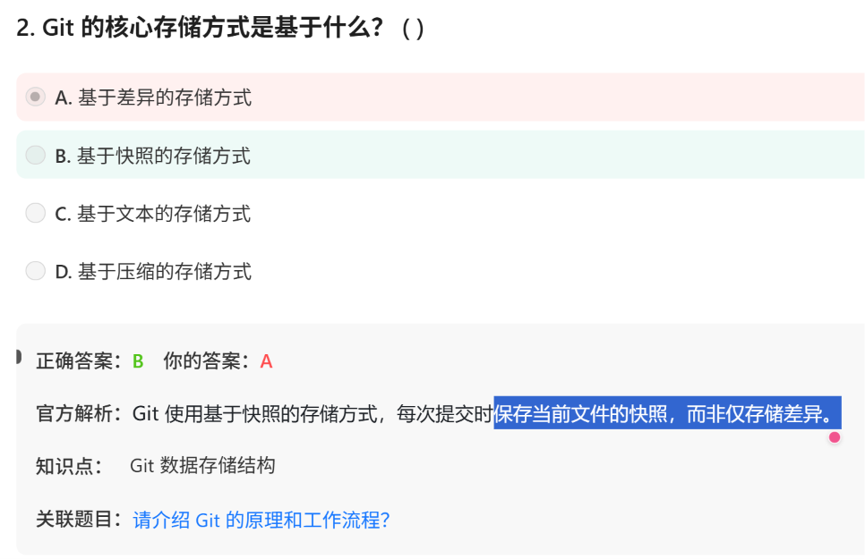

# 面试鸭 Git 概念笔试题  20260628




**Q1：Git 的快照（Snapshot）和差异（Diff/Delta）是完全不同的存储方式！**

- **差异存储**：只保存**修改的部分**（节省空间）
- **快照存储**：保存文件的**完整副本**（冗余但速度快）

差异存储在还原时，要计算——所以就会慢

Q2：git只记录commit历史而不记录push历史

**Git 不记录 `push` 历史的原因：**

1. **push 只是同步操作**，不是版本历史的一部分
2. **查看历史**：应该看 `commit` 历史，不需要知道何时 `push`
3. **push 记录**：在远程仓库有日志（如 GitHub 的 Actions 日志），但不属于 Git 版本控制

Q3： commit到底提交了啥


每个提交对应一个树对象

普通提交只有一个父对象，初始提交没有父对象，而合并提交会产生多个父对象


Q4：三种分支策略


# 第二组：  github与gitlab的区别


# 第三组 PR/MR的命名

（1）为什么要叫Pull Request？——因为git pull是从contributor视角，从origin拉取到本地

而Pull Request是请求让maintainer来拉取贡献者的仓库到自己仓库。

（2）为啥我实际上做PR/MR是做分支合并而不是做“更新分支（本地上某分支变化应用到服务器分支上）”——因为我是有写入权限，所以我git push时候就已经更新了

——实际上没有权限的情况下，是contributor先fork**一个仓库在自己服务器上**，写好更新后，发起PR/MR，让maintainer去应用这个分支的更新！！


# 第四组 git中的Fast-Forward Merge

- 当master主分支是A←B，而feat1分支是A←B←C时候，要更新master主分支，只需要主分支加上C就可以了，这叫Fast-Forward
- 当A←B是最开始的master，此时feat1分支出去，并产生了A←B←C，想要合并回来的时候发现master已经不是原来的master了，master也在被其他分支其他人复写(我怎么觉着这个说法有点奇怪，有点像某些男女关系？哈哈)变成了A←B←D，那么这时候要合并，就要重新再commit一次，变成A←B←C&D←E了。

```jsx
"""
好处：
✅ 历史清晰，没有多余的合并提交
✅ 适合个人开发或小型团队

坏处：
❌ 丢失了分支信息（不知道 feature 是从哪里分支的）
❌ 难以追溯功能的完整历史

建议：
- 个人开发：可以用 Fast-forward
- 团队协作：推荐 git merge --no-ff
"""
```

# 第五组 git diff, git status, git log


`git diff staged`  或者  `git diff --cached` 

`-staged` 是 `-cached` 的同义词，两者功能完全相同。它们的作用都是**查看暂存区（staging area / index）与最后一次提交（HEAD）之间的差异**。

这种命名上的差异主要源于历史。早期 Git 主要使用 `--cached`，因为暂存区在内部被称为 "index" 或 "cache"。后来为了更贴近 `git add` 和 `git commit` 工作流中的"暂存"概念，引入了 `--staged` 作为更直观的选项


# 第六组 四区

work directory

staged

repo

remote repo

Q1: 能跳过Staging area么？


**确实有命令可以"跳过"暂存区，直接从工作区提交到本地仓库！**

- `git commit -a` 或 `git commit -am "message"`
- 但这**不是真正的"跳过"**，而是**自动执行了 `git add`**！

Q2：git reset


`git reset HEAD`

Q3： 如何只选择一部分staging area提交到repo

# 其他


Mercurial是git的竞品，但是2020已经停止运营了


文件的四状态USMC

```jsx
Untracked --> git add --> Staged
Staged --> git commit --> Committed
Modified --> git add --> Staged
Modified --> git checkout <file> --> Unmodified

```