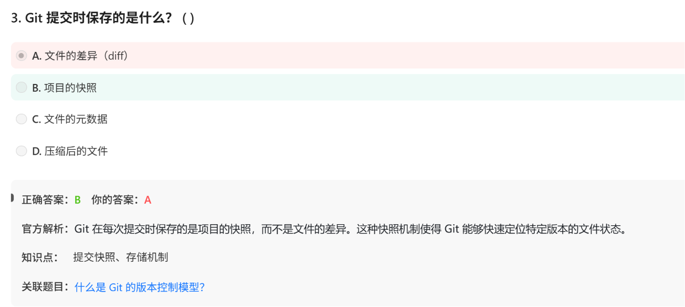

# 面试鸭 git概念 20260629（一周目完结）

# 第一组 git

# 第二组 git commit

# 第三组： git branch

第四组

# 第五组 git gc

# 第六组 工作流

# 第七组 合并冲突

# 第八组 删除分支的影响

# 第九组：三种合并策略，尤其3 way merge

**3-way merge = 对比 Base（共同祖先）、Ours（当前分支）、Theirs（目标分支）三方，智能判断改动，能自动合的就自动合，有冲突就交给用户处理。**

# 第十组 裸存储库 bare repository

仅含.git不包含工作区

（裸存储库仅包含版本控制数据，不包含工作区文件）

# 第十一组 .git目录

# 第十二组 git hook

# 第十三组 git 是C语言开发的

其他

