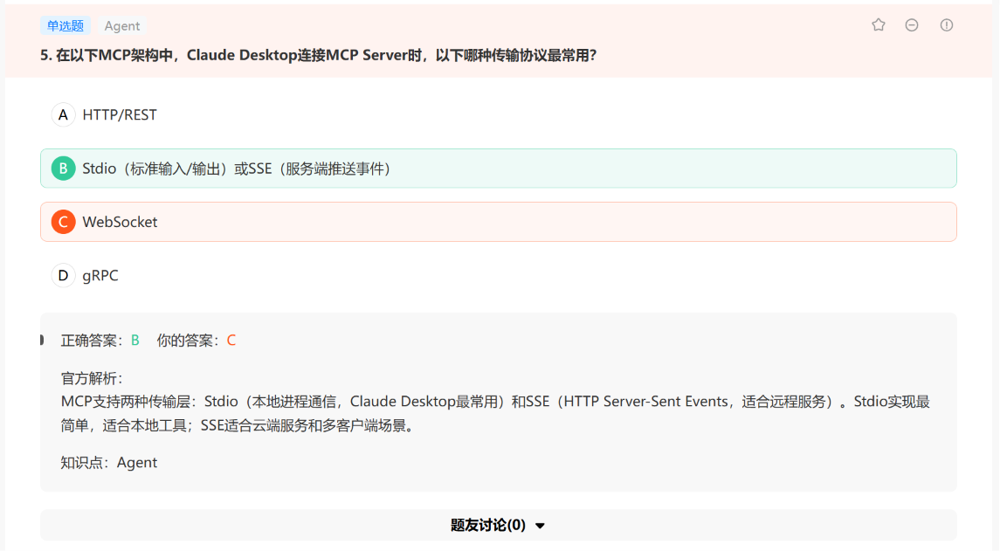

# 牛客网Agent 20260625

笔记：

- 幻觉传播（hallucination Propagatioon）早期步骤的幻觉作为事实输入下游步骤，导致错误累积放大
- 工具幻觉防范方法：①结构化输出（最有效）：Function Calling/Tool Use API要求LLM从提供的工具列表中选择（而非自由文本），从语法层面消除幻觉；②工具检索（Tool RAG）：当工具数量很多时（>20），先用query检索最相关的K个工具注入上下文（减少选择干扰）；③工具名称清晰化：避免相似名称（get_user vs fetch_user）；④示例：在工具描述中提供调用示例，减少参数格式错误。
- 专家路由架构（Router + Specialists）：

Router Agent根据问题类型将请求路由到专业子Agent（法律Agent、医疗Agent、技术Agent等）

每个专家Agent：专属system prompt（强调特定领域知识）、专属工具集（法律数据库、医疗文献数据库）、专属few-shot示例。

- **防止"Agent集体失败"（Cascading Failure）：**

Agent间独立性+熔断机制（子Agent失败不影响整体任务继续）

- **Reactive Agent vs Deliberative Agent"（反应式Agent vs 审议式Agent）的区别**

反应式（ReAct类）：观察→立即行动，快速但易陷入局部最优；审议式（Plan-and-Execute类）：先规划全局再执行，慢但对复杂任务更可靠

- **LangGraph相比LangChain的主要优势是什么？**

LangGraph支持有环图（循环执行），可以定义包含条件分支和循环的有状态Agent工作流

- **MCP（Model Context Protocol）中，Resources和Tools的区别是什么？**

Resources是只读数据源（文件、数据库、API数据），Tools是可以执行操作并产生副作用的函数

- **Dify工作流（Workflow）和Agent的区别**

工作流是预定义的固定流程（DAG），Agent是LLM自主决策的动态执行，两者可以组合使用

- **哪种内存架构最适合"个人助手Agent"（需要记住用户偏好和历史）？**

多层记忆：会话级（短期）+ 用户偏好（长期向量存储）+ 关键事件（结构化数据库）

- **哪种设计模式在Agent系统中被称为"Saga Pattern"（事务链模式）？**

Saga Pattern借鉴微服务架构的分布式事务解决方案：将Agent的多步操作（如"创建订单→扣库存→付款→发货"）定义为事务链，每步成功才进行下一步，任何步骤失败触发补偿事务（如退款→恢复库存→取消订单）。保证Agent长任务的数据一致性。